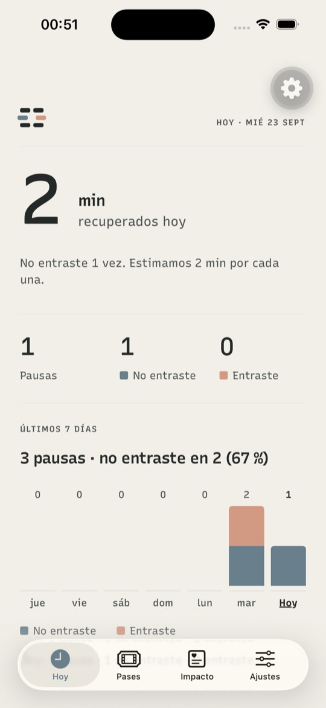
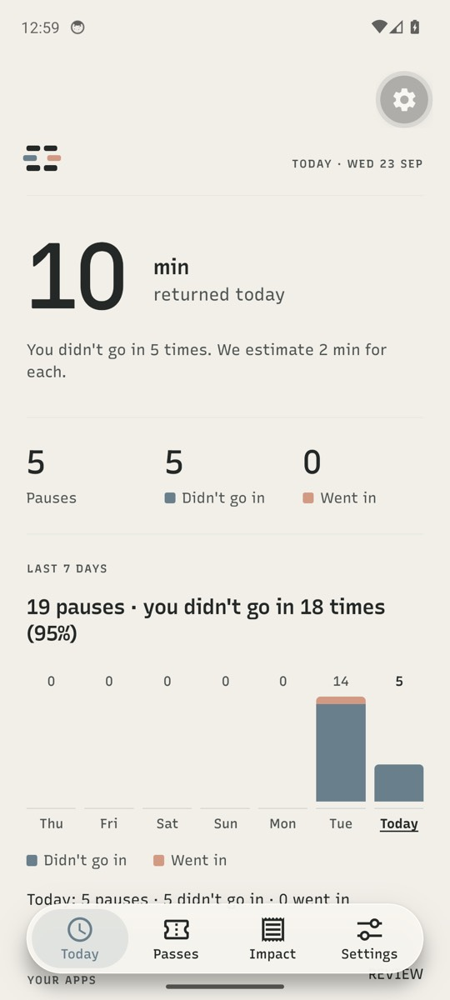
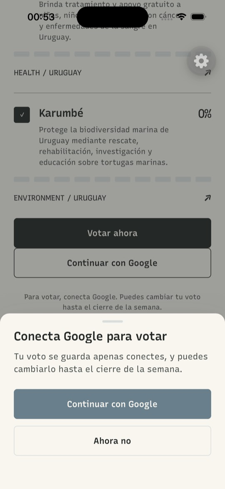
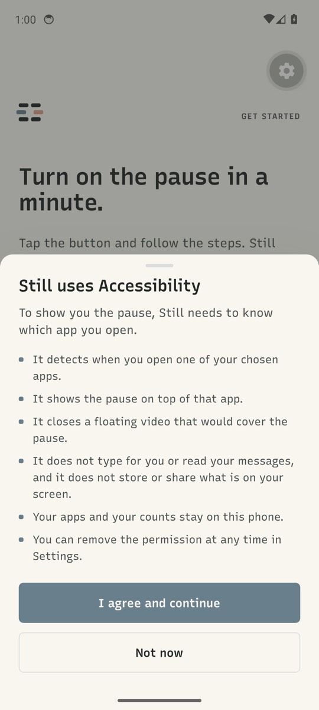
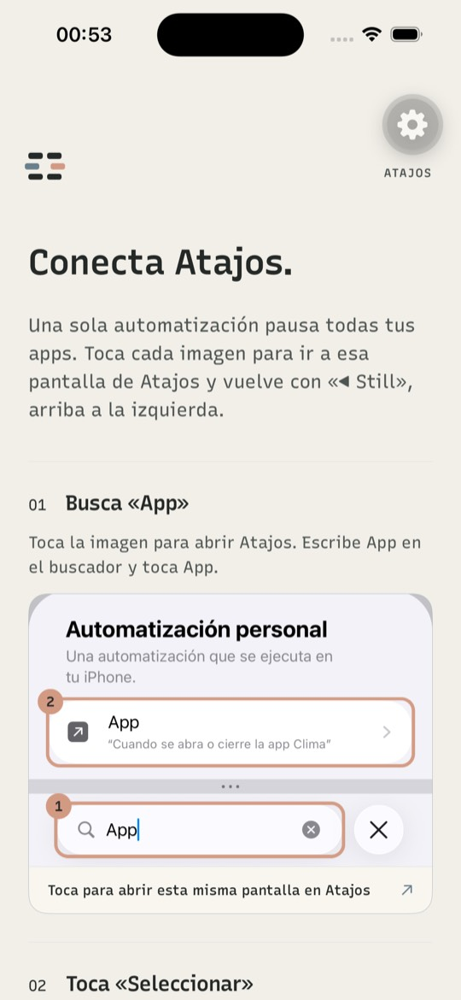
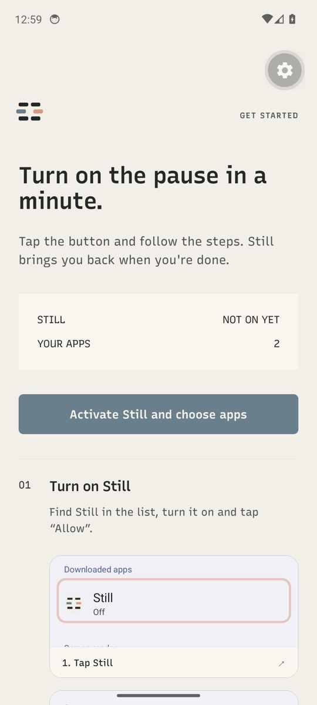
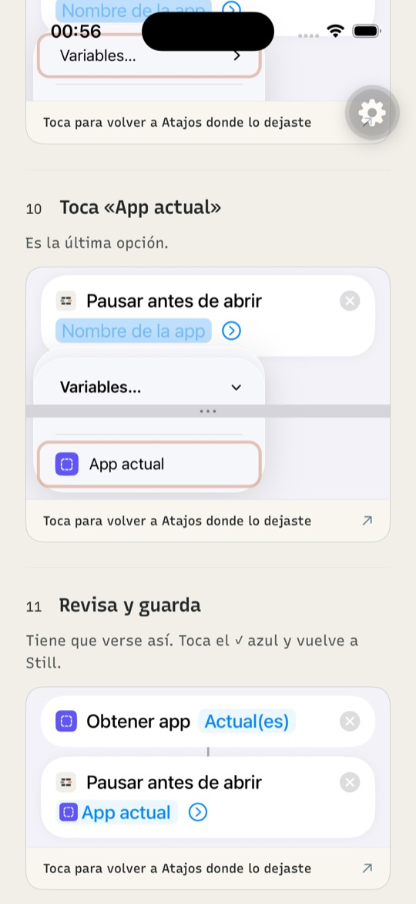
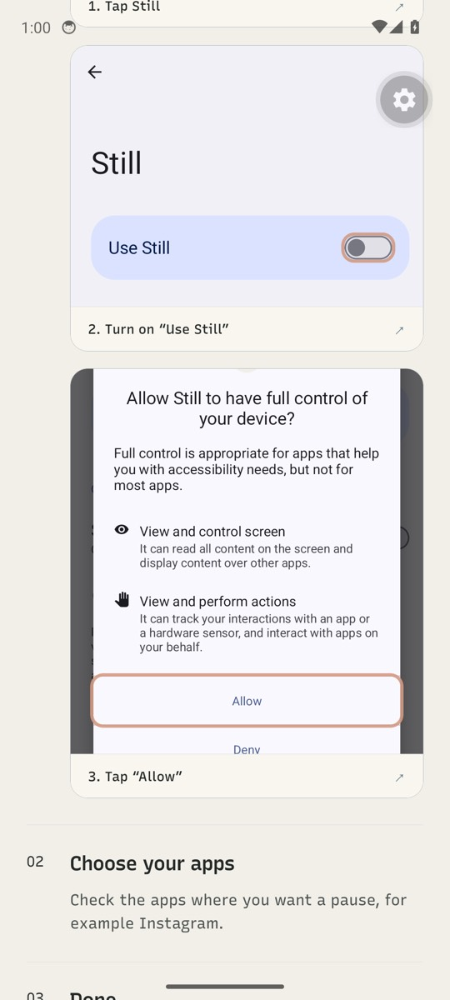

# Still · Claridad de UI: avisos, Hoy y guías replicadas en código — investigación y plan

Fecha: 2026-09-22 · Rama base: `feat/access-duration-slider-and-live-expiry` (HEAD `3f19915`) ·
Estado: **plan listo, sin implementar**. El prompt de `/goal` está en §9.

Pedido del usuario (2026-09-22), en tres partes:

1. **Avisos.** Todo aviso pasa a ser nativo con la estética de Still. Si el aviso pide
   una acción (p. ej. "tienes que conectar Google"), trae el botón que la hace. Los
   textos dicen siempre lo que le importa al usuario; nunca explican lo que *no*
   ocurre ("aquí no se define cuánto tiempo te desbloquea").
2. **Hoy.** Los datos se entienden de un vistazo (hoy "el uso de la semana" no se
   entiende) y **son los mismos en iOS y Android**.
3. **Guías de setup (iOS y Android).** Explicación más simple. Nunca una app del
   usuario (p. ej. "Jazmin Chebar") como ejemplo: **Instagram** en los pasos normales y
   **una app ficticia** en los de apps propias. Las capturas se **replican en código**,
   mostrando exactamente lo mismo; solo cambian el icono/app (News → Instagram) y los
   textos.

> **Cómo se obtuvo la evidencia.** [código] = leído en el repo. [simulador] = visto en
> el iPhone 15 / iOS 26.0 (`D7C2610B…`) con el build instalado. [Apple] = tablas de
> localización del runtime iOS 26.0 del simulador
> (`/Library/Developer/CoreSimulator/Volumes/iOS_23A343/…/RuntimeRoot`, `*.lproj/*.strings`
> de `WorkflowUI`, `WorkflowKit`, `ActionKit`, `WorkflowEditor`, `ContentKit`,
> `Shortcuts.app`). [AOSP] = `strings.xml` de `android14-release`
> (`frameworks/base/core/res` y `packages/apps/Settings`, `values`, `values-es`,
> `values-es-rUS`), la misma versión que las capturas del emulador Pixel 6 API 34.

---

## 0. Decisiones firmes (no reabrir)

| # | Decisión | Origen |
|---|---|---|
| **D1** | **Avisos = hoja desde abajo** (`StillSheet`), presentada en un `Modal` nativo de React Native con tokens, tipografía y `PrimaryButton` de Still. Desaparece **todo** `Alert.alert` de `app/` y `src/`; un test lo impide a futuro. | Usuario, 2026-09-22 |
| **D2** | **Todo aviso que implica una acción trae el botón que la ejecuta** (Conectar Google, Abrir Accesibilidad, Elegir apps, Reintentar, Instalar Atajos, Copiar enlace…). La acción corre al cerrarse la hoja. | Usuario |
| **D3** | Confirmaciones de éxito **sin siguiente paso** ("Límites guardados", "Voto guardado") usan un **aviso breve no bloqueante** (`StillToast`, misma estética, 4 s, anunciado a lectores de pantalla). Si hay siguiente paso útil, es hoja con ese botón ("Google conectado" → "Ir a votar"). | Este plan |
| **D4** | **Hoy = pausas por día**, idéntico en iOS y Android, con datos propios de Still. Se quitan de Hoy el tiempo de pantalla, los reportes nativos (`ActivityReport` / `DeviceActivityReport`) y **el permiso Usage Access de Android** (`PACKAGE_USAGE_STATS`) con su bloque opcional. | Usuario, 2026-09-22 |
| **D5** | Métricas: **Pausas** = `openAttempts`; **Entraste** = `unlocks` (anuncio, pase, emergencia o espera de 15 s — ambas plataformas ya lo cuentan así); **No entraste** = `max(0, Pausas − Entraste)` (incluye "Volver" y salir de la pausa sin elegir); **Minutos recuperados (estimado)** = No entraste × `config.estimatedMinutesPerAvoidedOpen`. | Este plan |
| **D6** | **"Hoy" es el día local del teléfono.** Todos los contadores (iOS y Android) pasan de clave de día UTC a día local; `/api/v1/wellbeing/daily` recibe la fecha local (la tabla solo se guarda y exporta; nada la agrega). El día del cambio puede quedar un día con conteo mezclado: aceptado. | Este plan |
| **D7** | **Guías replicadas en código, sin imágenes.** Se borran los 16 JPG de `assets/shortcut-guide/`, los 3 PNG de `assets/android-guide/`, los manifiestos generados y los scripts de recorte. **Reemplaza la D9 del plan Android** (capturas reales). | Usuario, 2026-09-22 |
| **D8** | **Ejemplos:** Instagram en los pasos normales (reemplaza a News en las réplicas); **"Tilo"** (app ficticia, icono propio) en los pasos de apps propias. El nombre de una app del usuario **nunca** es ejemplo: solo aparece donde hay que actuar sobre ella (lista de atajos a crear, fila de prueba). | Usuario (app ficticia: nombre propuesto por este plan) |
| **D9** | **Idioma de las réplicas = idioma del teléfono**, con los textos oficiales de Apple/Google (Apéndices A y B). Español de España vs Latinoamérica según la región del idioma (§4.2). Las instrucciones citan **la misma cadena** que dibuja la réplica (una sola fuente). | Este plan |
| **D10** | El aro "toca aquí" se dibuja **alrededor del elemento real de la réplica** (`<Tap n>`), no con coordenadas. Se conserva el estilo actual (aro peach 3 px, pulso, numeración si hay varios). | Este plan |
| **D11** | Iconos: **SF Symbols vía `expo-symbols`** en réplicas iOS (ya compilado en el Podfile por `expo-router`, `ExpoSymbols 57.0.2`; solo falta declararlo en `package.json`); **Material Icons** (`@expo/vector-icons`, ya instalado) en réplicas Android. Iconos de apps dibujados con `View` + gradientes de RN 0.86 (`experimental_backgroundImage`, lineal y radial); el glifo de Instagram es `Ionicons "logo-instagram"`. Still = `FieldApertureMark` sobre chalk. | Este plan |
| **D12** | La acción de Still en Atajos se **localiza al español** ("Pausar antes de abrir"). Si tras el build no aparece traducida en un simulador en español, se revierte y réplicas + textos muestran el inglés ("Pause Before Opening"). | Este plan |
| **D13** | Se añade `expo-clipboard` (versión de SDK 57) para **Copiar nombre** de los atajos de vuelta y **Copiar enlace** en Impacto. | Este plan |
| **D14** | La divulgación de Accesibilidad de Android conserva **todos** los elementos que exige Google Play (qué detecta, para qué, qué no recoge, que se puede desactivar); cambia la presentación (hoja) y la redacción, no el contenido. Es la única excepción a la regla "no explicar lo que no pasa". | Este plan / Play |
| **D15** | Permiso de notificaciones: **solo en iOS** (el aviso de "vuelve la pausa" es de iOS; Android no publica notificaciones) y **precedido por una hoja Still** que dice para qué sirve. Android deja de pedirlo. | Este plan |
| **D16** | Nada de lenguaje visual nuevo: tokens de `src/theme/tokens.ts`, `PrimaryButton`, `typography`. Hoja: `radius.modal`, `shadows.modal`, fondo `chalkRaised`; velo graphite. Movimiento `motion.standard`; con Reduce Motion, sin desplazamiento. | Brand v3 |

Heredadas y vigentes: D1–D8 del plan iOS v2 y D1–D8/D10 del plan Android (voz de
producto). Lógica nueva en **módulos puros con tests Vitest**; textos con
`localize(en, es)`.

---

## 1. Diagnóstico

### 1.1 Avisos

25 llamadas a `Alert.alert` en 7 archivos [código]. Ninguna trae la acción que pide;
varias mandan a otra pantalla ("Vincula Google desde Ajustes"). No hay diálogos
nativos propios en Kotlin ni en Swift. Inventario y reemplazo en §2.4.

### 1.2 Hoy

| Problema | Evidencia |
|---|---|
| En iOS, "TIEMPO EN APPS / 7 DÍAS" y "DETALLE DEL DISPOSITIVO" salen **vacíos**: `DeviceActivityReport` necesita autorización de Family Controls, que el modo Atajos nunca pide. | [simulador] capturas de Hoy, 2026-09-22 |
| En Android, el semanal son 5 módulos por día **sin números ni unidad**, y las etiquetas de día son fijas `L M X J V S D` aunque los datos son "hace 6 días … hoy" (hoy casi nunca es "D"). iOS tiene el mismo error de etiquetas. | `activity-report.android.tsx`, `DeviceActivityReportExtension.swift` |
| Mezcla de alcances: Android muestra tiempo de las apps elegidas junto a **activaciones de todo el teléfono**; iOS mostraría tiempo de todo el teléfono. | `StillRestrictionModule.getLocalWellbeing`, extensión iOS |
| Sin Usage Access (opcional), Android muestra `0m` / `0 ACTIVACIONES` como si fueran datos. | [código] |
| "Aperturas evitadas" aparece dos veces (texto del hero y columna). | `(today)/index.tsx` |
| Jerga: "EN DISPOSITIVO", "PRIVADO", "DETALLE DEL DISPOSITIVO", "CONCILIADO", "aperturas automáticas se convirtieron en decisiones conscientes". | [simulador] |
| "Hoy" se reinicia a medianoche **UTC** (21:00 en Uruguay): contadores con `LocalDate.now(ZoneOffset.UTC)` (10 lugares en Kotlin) y `utcDay()` en Swift. | [código] |
| Los minutos "recuperados" son una estimación sin explicar de dónde salen. | [código] |

### 1.3 Guías

| Problema | Evidencia |
|---|---|
| El ejemplo es **la primera app elegida**: `exampleName = chosen[0]?.name ?? "YouTube"`; con una app propia el paso dice "Un camino de vuelta a Jazmin Chebar" (el título además se corta). | `shortcut-setup.tsx:385`, [simulador] |
| Los pasos del atajo de vuelta solo cubren **la primera** app propia (`schemeless[0]`); si hay varias, las demás no tienen instrucciones. | `shortcut-setup.tsx:386` |
| Capturas en inglés con copy en español que cita botones en inglés ("Toca «Search Actions»", "Run Immediately") mientras `shortcut-repair.tsx` usa "Ejecutar inmediatamente": inconsistente, y en un iPhone en español los botones se llaman distinto. | [código] + [Apple] |
| Copy largo y con mecánica ("Still no puede reabrir…", "iOS no deja…", "la imagen muestra News como ejemplo"). | [código] |
| Las capturas dependen de imágenes recortadas (16 JPG + 3 PNG) y de scripts que necesitan capturas crudas no versionadas. | `scripts/shortcut-guide/build.swift`, `scripts/android-guide/build.mjs` |

### 1.4 Textos

~90 cadenas con marco negativo, jerga o mecánica (lista en §5.2). Casos típicos:
"Cuánto tiempo mantiene abierta una app cada pase se elige al usarlo, **no aquí**…",
"Los pases se reinician a medianoche **UTC**", "El **ledger** financiero se conserva solo
**pseudonimizado**", "Still **no inventará** una causa de relleno", "**No se infirió** ni
reemplazó nada con datos de demostración", "Continuar es una elección, **no un fracaso**".

---

## 2. Avisos: `StillSheet` y `StillToast`

### 2.1 API

```ts
// src/components/still-sheet.tsx (provider + UI) · src/lib/sheet-queue.ts (puro, con tests)
type SheetAction = {
  label: string;
  variant?: "signal" | "primary" | "secondary" | "quiet" | "danger"; // PrimaryButton
  onPress?: () => void | Promise<void>; // corre DESPUÉS de cerrar la hoja
};
type SheetOptions = {
  title: string;
  message?: string;
  bullets?: string[];        // solo para la divulgación de Accesibilidad
  actions: SheetAction[];    // la primera es la principal; "Ahora no"/"Cerrar" va última y quiet
  dismissible?: boolean;     // velo, deslizar abajo y atrás de Android → null (default true)
};
const { show, toast } = useStillSheet();
const chosen: number | null = await show(options); // índice de la acción o null
toast({ message: "Límites guardados.", tone: "success" });
```

- `StillSheetProvider` se monta en `app/_layout.tsx` dentro de `SafeAreaProvider`,
  envolviendo `<Navigation />`. Cola FIFO: si se pide una hoja con otra abierta, espera.
- Las acciones corren al terminar la animación de cierre (evita conflictos con la hoja de
  OAuth de Google, `openURL` o el selector de apps).
- `toast` se dibuja como capa absoluta (no `Modal`, no bloquea toques) sobre la barra de
  pestañas; se usa solo en pantallas de pestañas.

### 2.2 Aspecto y comportamiento

- `Modal transparent statusBarTranslucent navigationBarTranslucent animationType="none"`;
  el contenido va envuelto en su propio `SafeAreaProvider` (en Android el `Modal` es otra
  ventana y los insets del padre no llegan).
- Velo `graphite` al 40 %; hoja `chalkRaised`, radio superior `radius.modal`,
  `borderCurve: "continuous"`, `shadows.modal`, asa de 36×4 `fog` arriba.
- Título `Heading` 21/24; mensaje `Body` 15/22 `graphiteSoft`; acciones apiladas a lo ancho
  (`PrimaryButton`, 52 pt), la principal arriba; margen inferior = inset + `spacing.lg`.
- Entra desplazándose desde abajo en `motion.standard` (200 ms, `easeOut`), el velo en
  fade; con Reduce Motion aparece sin desplazamiento. Deslizar hacia abajo cierra si
  `dismissible`.
- Accesibilidad: `accessibilityViewIsModal`, foco al título al abrir
  (`AccessibilityInfo.setAccessibilityFocus`), `onRequestClose` = cerrar (Android atrás).
  Destructivas con `variant: "danger"` y separadas de la principal por `spacing.md`.
- Toast: fondo `graphite`, texto `chalk` 15/21, radio `radius.surface`, icono ✓ en
  `mineralLight` para éxito; `accessibilityLiveRegion="polite"` +
  `AccessibilityInfo.announceForAccessibility`.

### 2.3 Guardas

- `src/lib/no-system-alerts.test.ts` (mismo patrón que `linking-usage.test.ts`): falla si
  algún archivo de `app/` o `src/` importa `Alert` de `react-native` o llama `Alert.alert`.
- `src/lib/sheet-queue.test.ts`: cola, resolución con índice/`null`, orden de ejecución
  (acción después de cerrar), descarte de duplicados idénticos seguidos.

### 2.4 Los 25 avisos (y 1 nuevo)

Copy en español; el inglés dice lo mismo con naturalidad. Botón en **negrita** = principal.

| # | Dónde (hoy) | Título nuevo | Mensaje nuevo | Botones → acción |
|---|---|---|---|---|
| A1 | `shortcut-setup.tsx:427`, `shortcut-repair.tsx:144` "No se pudo abrir Atajos" | Falta la app Atajos | Still usa Atajos de Apple para mostrar la pausa. Es gratis. | **Instalar Atajos** → `Linking.openURL("itms-apps://apps.apple.com/app/id915249334")`; Ahora no |
| A2 | `shortcut-setup.tsx:455` "Ahora abre {app}" | Ahora abre {app} | Ve a tu pantalla de inicio y abre {app}. Si ves la pausa de Still, quedó conectada. | **Entendido** |
| A3 | `android-setup.tsx:83` divulgación | Still usa Accesibilidad | Para mostrarte la pausa, Still necesita saber qué app abres. + viñetas: "Detecta cuándo abres una de tus apps elegidas." · "Muestra la pausa encima de esa app." · "Cierra el video flotante que taparía la pausa." · "No escribe por ti ni lee tus mensajes, y no guarda ni comparte lo que hay en tu pantalla." · "Tus apps y tus conteos se quedan en este teléfono." · "Puedes quitar el permiso cuando quieras en Ajustes." | **Aceptar y continuar** (signal); Ahora no · `dismissible: false` (D14) |
| A4 | `android-setup.tsx:151` "Still todavía no está activo" | Falta activar Still | En {Accesibilidad}, toca Still y activa «{Usar Still}». Después vuelve aquí. | **Abrir Accesibilidad** → `openAccessibilitySettings()`; si `likelyRestricted`: Abrir información de Still → `openAppInfo()`; Ahora no |
| A5 | `android-setup.tsx:169` "Elige al menos una app" | Elige tus apps | Marca las apps donde quieres ver la pausa. | **Elegir apps** → `presentAppPicker()` + `applyRestrictions`; Ahora no |
| A6 | `android-setup.tsx:178` "No se pudo terminar" | No pudimos terminar | Tus apps elegidas siguen guardadas. | **Reintentar** → `runRequiredSetup()`; Cerrar |
| A7 | `android-setup.tsx:196` "Las estadísticas reales siguen apagadas" | — se elimina con Usage Access (D4) | — | — |
| A8 | `android-setup.tsx:210` "No se pudo abrir esa pantalla" | — se elimina con Usage Access (D4) | — | — |
| A9 | `(tokens):83` "Recompensa no disponible" | El anuncio no cargó | Prueba otra vez en un momento. (si hay: "Tienes {n} accesos de emergencia para hoy.") | **Reintentar** → `earn()`; Cerrar |
| A10 | `(tokens):149` "No se pudo desbloquear" | No se abrió la app | Tu pase sigue guardado. | **Reintentar** → `openForChosenWindow()`; Cerrar |
| A11 | `(impact):110` "Voto guardado" | toast | Voto guardado. Puedes cambiarlo hasta el cierre de la semana. | — |
| A12 | `(impact):123` "Vincula tu cuenta / Vincula Google desde Ajustes" | Conecta Google para votar | Tu voto se guarda apenas conectes, y puedes cambiarlo hasta el cierre de la semana. | **Continuar con Google** → `linkIdentity("google")` y, si queda vinculado, `vote.mutate()` → toast A11; Ahora no |
| A12b | `(impact):123` error de red | No se guardó tu voto | Revisa tu conexión. | **Reintentar** → `vote.mutate()`; Cerrar |
| A13 | `(impact):157` "No se pudo abrir el enlace" | No se abrió el enlace | Puedes copiarlo y abrirlo en tu navegador. | **Reintentar** → `openExternal(url)`; Copiar enlace → `Clipboard.setStringAsync(url)` + toast "Enlace copiado."; Cerrar |
| A14 | `(settings):172` "Límites guardados" | toast | Límites guardados. | — |
| A15 | `(settings):180` "No se pudieron guardar los límites" | No se guardaron tus límites | Revisa tu conexión. | **Reintentar** → `persistPreferences()`; Cerrar |
| A16 | `(settings):203` y `:216` "Google conectado" | Google conectado | Ya puedes votar por el proyecto de esta semana. | **Ir a votar** → `router.push("/(tabs)/(impact)")`; Listo |
| A17 | `(settings):229` "No se pudo vincular" | No se conectó Google | Revisa tu conexión y vuelve a intentarlo. | **Reintentar** → `link("google")`; Cerrar |
| A18 | `(settings):257` "No se pudo exportar" | No se descargaron tus datos | Revisa tu conexión. | **Reintentar** → `exportData()`; Cerrar |
| A19 | `(settings):271` "Opciones de privacidad no disponibles" | Las opciones de anuncios no cargaron | Vuelve a intentarlo en un momento. | **Reintentar** → `showAdvertisingPrivacyOptions()`; Cerrar |
| A20 | `(settings):285` confirmar borrado | ¿Eliminar tu cuenta? | Se borran tu cuenta, tus pases y tu historial. El registro de donaciones se conserva sin datos que te identifiquen. Es definitivo. | **Eliminar definitivamente** (danger); Cancelar |
| A21 | `(settings):311` "Cuenta eliminada" (limpieza local incompleta) | Cuenta eliminada | Para borrar también lo guardado en este teléfono, desinstala Still. | **Entendido** |
| A22 | `(settings):320` "No se pudo eliminar" | No se eliminó tu cuenta | Tus datos siguen como estaban. | **Reintentar** → misma acción de borrado; Cerrar |
| A23 | `(onboarding):141` "Configuración en pausa" | No pudimos continuar | Vuelve a intentarlo. | **Reintentar** → `next()`; Cerrar |
| N1 | nuevo, antes del permiso de notificaciones (solo iOS, D15) | Te avisamos cuando termina tu tiempo | Un aviso en el segundo exacto en que vuelve la pausa. | **Activar avisos** → `Notifications.requestPermissionsAsync`; Ahora no (no volver a preguntar en 7 días; guardar en `storage`) |

Los permisos del sistema (Accesibilidad, notificaciones, formulario de consentimiento de
anuncios de Google) siguen siendo del sistema: no se pueden restilizar; por eso van
precedidos de una hoja Still (A3, N1).

---

## 3. Hoy (igual en iOS y Android)

### 3.1 Datos nativos

`getLocalWellbeing()` devuelve, en ambas plataformas:

```ts
type DayMetrics = { date: string /* YYYY-MM-DD local */; openAttempts: number; avoidedOpens: number; unlocks: number };
type LocalWellbeingStats = { openAttempts: number; avoidedOpens: number; unlocks: number; history: DayMetrics[] /* 7, del más viejo a hoy */ };
```

- **iOS** (`SharedRestrictionState.swift`): `utcDay()` → `localDay()` (`Calendar.current`,
  `TimeZone.current`, `en_US_POSIX`, `yyyy-MM-dd`) para `productMetrics:<día>` y
  `targetMetricsKey`; `productMetrics(day:)` para leer cada día; `getLocalWellbeing` arma
  `history`. Se eliminan `controlledScreenTimeSeconds`, `weeklyScreenTimeSeconds` y
  `requestWellbeingAuthorization` (Swift + `StillRestrictionEngine.m`).
- **Android**: un solo helper `StillDay.today()` = `LocalDate.now()` (zona del sistema) en
  los 10 usos de `LocalDate.now(ZoneOffset.UTC)` (`StillAccessibilityService.kt` ×2,
  `InterventionActivity.kt` ×4, `StillRestrictionModule.kt` ×4); `history` lee
  `open_attempts:<día>`, `avoided_opens:<día>`, `unlocks:<día>` de los 7 días locales. Se
  eliminan `UsageStatsManager`, `hasUsageAccess`, `requestWellbeingAuthorization`,
  `wellbeingAuthorization` en `getHealth`, y `PACKAGE_USAGE_STATS` en `app.config.ts` y
  `AndroidManifest.xml`.
- **JS**: `restriction-engine.ts` refleja el contrato; `app-state.tsx` guarda `stats.history`;
  el POST a `/api/v1/wellbeing/daily` usa la fecha local y `controlledScreenTimeSeconds: 0`
  (sigue siendo obligatorio en el contrato).
- Se borran `src/native/activity-report.tsx` y `activity-report.android.tsx`. El código
  nativo de iOS (`StillActivityReportView`, extensión `StillDeviceActivityReport`) queda en
  el árbol sin uso, como el resto del spike de Family Controls (README).

### 3.2 Módulo puro `src/lib/today-summary.ts` (tests en `today-summary.test.ts`)

- `dayOutcome(m)` → `{ pauses: max(openAttempts, unlocks), entered: unlocks, notEntered: pauses − entered }` (D5).
- `summarizeWeek(history, { now, locale, minutesPerNotEntered })` → 7 columnas con
  `label` (día corto de `Intl.DateTimeFormat(locale, { weekday: "short" })` sin punto final;
  la última es "Hoy"/"Today"), `accessibilityLabel`, alturas relativas al máximo, totales
  de la semana y `% no entraste` (redondeado; sin porcentaje si no hubo pausas). Rellena con
  ceros los días que falten.
- `pauseStatus(input)` → título + acción + ruta de la fila "Tus apps" (tabla en §3.3), con
  entradas separadas para iOS (elegidas / conectadas) y Android (permiso / elegidas) y el
  interruptor remoto.

### 3.3 Diseño (de arriba a abajo)

1. **Encabezado**: marca + `HOY · MAR 22 SEP` (día de la semana + fecha, en el idioma).
2. **Abiertas ahora** (solo si hay ventanas): `ABIERTA AHORA`; filas "{App}" + a la derecha
   "vuelve la pausa en 04:12" (mono, cuenta atrás nativa como hoy).
3. **Protagonista**: número grande de minutos + "min recuperados hoy". Debajo, una línea:
   "No entraste {n} veces. Estimamos {m} min por cada una." Sin pausas hoy: "Cuando Still
   pause una app, aquí verás el tiempo que recuperas." Sin apps elegidas, este bloque se
   reemplaza por "Elige las apps donde quieres una pausa" + **Elegir apps**.
4. **Hoy en números**: tres columnas con la misma línea base — `{pausas}` Pausas ·
   `{no entraste}` No entraste (cuadrito mineral) · `{entraste}` Entraste (cuadrito peach).
   Reemplaza la fila "apps protegidas / aperturas evitadas".
5. **Últimos 7 días**: `ÚLTIMOS 7 DÍAS`; resumen "23 pausas · no entraste en 15 (65 %)";
   gráfico de 7 columnas con el total encima (mono 12, tabular), barra apilada (abajo
   *no entraste* en `mineral`, arriba *entraste* en `peach`, radio 3, altura máx. 96,
   mínimo 3 si > 0, línea base `fog`); etiquetas reales ("mié … lun Hoy", hoy en negrita);
   leyenda "■ No entraste ■ Entraste". Tocar una columna la selecciona y actualiza la línea
   de detalle "Lun 21: 5 pausas · 3 no entraste · 2 entraste" (por defecto, hoy). Semana
   vacía: "Tus pausas de los últimos 7 días aparecerán aquí." Accesibilidad: resumen en el
   contenedor y cada columna como botón con su descripción.
6. **Tus apps** (fila con flecha, `pauseStatus`):

   | Estado | Título | Acción → ruta |
   |---|---|---|
   | Pausas apagadas por config remota | Las pausas vuelven pronto | — |
   | iOS, 0 elegidas / Android, 0 elegidas | Elige tus apps | **Elegir apps** → `/ios-apps` · `/android-setup` |
   | Android sin permiso | Falta activar Still | **Activar** → `/android-setup` |
   | iOS, conectadas < elegidas | {c} de {n} apps conectadas | **Terminar de conectar** → `/shortcut-setup` |
   | Todo bien | Pausa activa en {n} apps | Revisar → `/ios-apps` · `/android-setup` |

7. **Fondo de esta semana**: `FONDO DE ESTA SEMANA` + monto + "Estimado"/"Confirmado" +
   flecha a Impacto. Cargando: esqueleto de la misma altura. Si no hay semana publicada o
   falla la carga, la fila **no se muestra** (nada de "NO DISPONIBLE" en Hoy).

Se van: "EN DISPOSITIVO", "PRIVADO", "DETALLE DEL DISPOSITIVO", "SIGUIENTE" (queda dentro
de "Tus apps"), el texto "aperturas automáticas se convirtieron en decisiones conscientes".

---

## 4. Guías replicadas en código

### 4.1 Arquitectura (`src/components/guide/`)

| Pieza | Qué hace |
|---|---|
| `mock-viewport.tsx` | Dibuja la réplica a su **ancho de referencia** (iOS 393 pt, como las capturas de iPhone 15; Android 411 dp, Pixel 6) y la escala con `transform: scale(ancho/ref)` desde arriba a la izquierda; alto = alto de referencia × escala. Así se ve igual que la imagen a cualquier ancho. |
| `mock-text.tsx` | `Text` con `allowFontScaling={false}`: la réplica es una imagen, no crece con Dynamic Type (el texto del paso sí). |
| `tap.tsx` | `<Tap n={1}>…</Tap>`: aro peach 3 px con inset −3 y radio 12, pulso de opacidad (sin pulso con Reduce Motion) y número si el paso tiene varios toques. Los contenedores que envuelven un `Tap` **no** usan `overflow: "hidden"`. |
| `guide-card.tsx` | Reemplaza el cascarón de `ShortcutGuideImage` / `AndroidGuideImage`: `Pressable` con borde `mineralLight`, radio `radius.modal`, pie con la acción ("Toca para abrir esta pantalla en Atajos ↗"); `accessibilityRole="imagebutton"`; la réplica interna con `importantForAccessibility="no-hide-descendants"` + `accessibilityElementsHidden`. |
| `system-strings.ts` | Tablas de los Apéndices A y B + `systemVariant()` (§4.2) + `sys(key, args?)`. |
| `app-icons.tsx` | Instagram, Mensajes, Still, Atajos, "Abrir app", "Obtener app actual", Tilo, icono genérico "App". |
| `ios/primitives.tsx` | Borde superior de hoja, franja separadora de bandas (gris `#D5D4DA` con `•••` centrados), tarjeta blanca, campo de búsqueda, botón circular (atrás/cerrar/✓ azul), píldora "Siguiente", chip, fila de acción, token de parámetro, popover de menú, interruptor iOS. |
| `ios/shortcuts-screens.tsx` | Las 16 pantallas de §4.3, cada una un componente con el mismo id que hoy (`auto-01-app-trigger` …). |
| `android/primitives.tsx` + `android/settings-screens.tsx` | Categoría, fila de servicio, tarjeta "Usar Still" con interruptor M3, diálogo con ítems e iconos, las 3 pantallas de §4.4. |

- Fuente: la del sistema (sin `fontFamily`): SF Pro en iOS, Roboto/la del sistema en
  Android; pesos 400/600/700 según la captura. Tamaños = px de la captura ÷ 2 (iOS, las
  capturas son @2x de 393 pt) o ÷ 2,625 (Android, 1080 px = 411 dp).
- Colores fijos del modo claro (la app es `userInterfaceStyle: "light"`); no usar
  `PlatformColor`. Muestras en el Apéndice C; afinar con el muestreador de §4.8.
- SF Symbols candidatos: `chevron.left`, `xmark`, `checkmark`, `magnifyingglass`,
  `xmark.circle.fill`, `mic`, `info`, `lightbulb`, `chevron.right`, `chevron.down`,
  `chevron.right.circle`, `arrow.up.forward.app.fill`, `app.dashed`, `arrow.up.right`,
  `switch.2`, `iphone`, `pencil`, `square.dashed`, `plus.square.on.square`, `folder`,
  `plus.square`. Para "Crear nuevo atajo" y el chip "Scripts", elegir el símbolo más
  parecido renderizando candidatos en el simulador; si ninguno coincide, componer
  (capas + `plus.circle.fill`).
- Material Icons: `arrow-back`, `visibility`, `pan-tool`.

### 4.2 Idioma y variante

`systemVariant()` usa `getLocales()[0]` de `expo-localization`:
- idioma ≠ `es` → **en** (tabla inglesa, idéntica a las capturas);
- `es` con región del idioma (`languageRegionCode`, o la parte de región de
  `languageTag`) = `ES`, o `languageTag === "es"` → **es** (España);
- cualquier otro español (`es-419`, `es-MX`, `es-US`, `es-UY`…) → **es-419**
  (Latinoamérica; en Android corresponde a `values-es-rUS`).

Función pura con tests. Las instrucciones de cada paso interpolan `sys("runImmediately")`,
etc., para que el texto cite exactamente lo que el usuario ve.

### 4.3 Pantallas iOS (misma composición que el JPG homónimo; `{x}` = clave del Apéndice A)

| id | Qué muestra | Toques |
|---|---|---|
| `auto-01-app-trigger` | Banda 1: borde de hoja; `{personalAutomation}` (negrita); `{personalAutomationSubtitle}`; tarjeta: icono gris "App" + `{app}` + `{appTriggerExample}` + `›`. Franja `•••`. Banda 2: buscador con "App" escrito y cursor azul, `xmark.circle.fill`; botón circular `xmark`. | ① buscador ② fila App |
| `auto-02-choose` | Botón atrás; píldora `{next}` deshabilitada; `{when}` (negrita grande); tarjeta `{app}` … `{choose}` (azul). | ① `{choose}` |
| `auto-03-pick-app` | `xmark`, `{chooseApp}` centrado, ✓ azul. Franja. Filas: Mensajes (icono) `{messages}`; separador; **Instagram** (icono) + ✓ azul. | ① fila Instagram ② ✓ azul |
| `auto-04-run-immediately` | Atrás; `{next}` azul. Franja. Tarjeta: `{runAfterConfirmation}`; `{runImmediately}` + ✓; `{notifyWhenRun}` + interruptor apagado. | ① `{runImmediately}` ② interruptor ③ `{next}` |
| `auto-05-create-new` | `{whenOpened: Instagram}` (dos líneas, negrita grande); 💡 `{getStarted}` `›`; mosaicos: `{createNewShortcut}` (gris), icono Atajos + `{unknownAction}`, y un tercer mosaico cortado por el borde con solo el filo de su icono (su texto no es legible en la captura). | ① `{createNewShortcut}` |
| `auto-06-search-actions` | Atrás; `{whenOpened: Instagram}` centrado; ✓ azul. Franja. Hoja con asa y buscador `{searchActions}` + micrófono. | ① buscador |
| `auto-07-pick-action` | Buscador con "Still" + cursor + borrar; `{cancel}` azul; chips `{scripting}`, `{controls}`, `{device}` y un cuarto cortado; fila "Still" (icono grande); tarjeta con icono Still + `{stillAction}` + ⓘ. | ① tarjeta de la acción |
| `auto-08-pick-name` | Tarjeta: icono Still + `{stillSummaryPrefix}` + token `{appNameParam}` (azul claro, desvanecido) + ⓧ, `›` en círculo; menú con **Instagram** y **Fitness**. | ① Instagram |
| `auto-09-save` | Atrás; `{whenOpened: Instagram}`; ✓ azul. Tarjeta: icono Still + `{stillSummaryPrefix}` + token **Instagram** + `›` en círculo. | ① ✓ azul |
| `return-01-open-app` | Asa; buscador `{searchActions}` + micrófono; chips; tarjetas: Mensajes `{sendMessage}` ⓘ, "Abrir app" (morado) `{openApp}` ⓘ. | ① `{openApp}` |
| `return-02-choose-app` | Atrás; icono gris de atajo + `{newShortcutN}` + `⌄` en círculo; tarjeta: icono morado + `{openTarget}` con token `{app}` desvanecido + ⓧ. | ① token `{app}` ② título |
| `return-03-rename` | Atrás; tarjeta tapada por el menú: ✏️ `{rename}`, ⬚ `{chooseIcon}`, `{duplicate}`, 📁 `{move}`, separador, `{addToHomeScreen}`. | ① `{rename}` |
| `single-01-current-app` | Asa; buscador con `{getCurrentAppAction}` escrito + borrar; `{cancel}`; chips; tarjeta icono morado + `{getCurrentAppAction}` + ⓘ. | ① buscador ② resultado |
| `single-02-variables` | Tarjeta de Still con token `{appNameParam}`; menú con `{variables}` `›` y separador. | ① `{variables}` |
| `single-03-pick-current-app` | Banda 1: tarjeta + cabecera del menú `{variables}` `⌄`. Franja. Banda 2: separador + icono morado `{currentApp}`. | ① `{currentApp}` |
| `single-04-result` | Tarjeta 1: icono morado + `{getScopeApp}` con token `{currentScope}` + ⓧ; conector; tarjeta 2: icono Still + `{stillSummaryPrefix}` + token (mini icono morado + `{currentApp}`) + `›`. | — |

Cambios respecto de las capturas: solo News → Instagram (icono y nombre) y los textos por
idioma. "Fitness" y el ejemplo de Apple "Tiempo/Clima/Weather" se quedan (son parte de la
UI de Atajos).

### 4.4 Pantallas Android (composición de los PNG; `{x}` = clave del Apéndice B)

| id | Qué muestra | Toque |
|---|---|---|
| `accessibility-find-still` | Fondo `#F1F0F7`; categoría `{downloadedApps}` (color primario); fila: icono Still en círculo + "Still" + `{off}`; la categoría `{screenReader}` asomando cortada abajo. | ① fila Still |
| `accessibility-turn-on` | Flecha atrás; título "Still" grande; tarjeta `#DAE2FF` radio 28 con `{useService}` + interruptor M3 apagado (pista con borde `#74757F`, pulgar chico `#74757F`). | ① interruptor |
| `accessibility-allow` | Velo `#5E5E61` a los lados; diálogo `#FAF8FF` con el círculo del icono de Still cortado arriba; `{enableServiceTitle}` centrado; `{warningDescription}`; ojo + `{screenControlTitle}` + `{screenControlDescription}`; mano + `{actionPerformTitle}` + `{actionPerformDescription}`; divisor `#C6C6CD`; `{allow}` en `#495D92`; divisor; `{deny}` cortado abajo. | ① `{allow}` |

### 4.5 Pasos, más simples

Reglas: un paso = una acción; título = el botón que se toca, citado con `sys()`; cuerpo de
una frase (dos como mucho); sin explicar el mecanismo; el ejemplo siempre es Instagram o
Tilo.

**iOS · una automatización para todas (iOS 18.2+, el caso del usuario en iOS 26/27).**
Lede: "Una sola automatización pausa todas tus apps. Toca cada imagen para ir a esa pantalla
de Atajos y vuelve con «◀ Still», arriba a la izquierda."

| Paso | Título | Cuerpo |
|---|---|---|
| `pick_app_trigger` | Busca «App» | Toca la imagen para abrir Atajos. Escribe App en el buscador y toca App. |
| `tap_choose` | Toca «{choose}» | Está a la derecha de App. |
| `select_all_apps` | Marca tus apps | Marca las apps que quieres pausar (en la imagen, Instagram) y toca el ✓ azul. |
| `run_immediately` | Toca «{runImmediately}» | Deja «{notifyWhenRun}» apagado y toca «{next}». |
| `create_new_shortcut` | Toca «{createNewShortcut}» | Es el primer recuadro. |
| `add_current_app` | Toca «{getCurrentAppAction}» | Escríbelo en «{searchActions}» y toca el resultado. |
| `search_actions` | Busca Still | Toca «{searchActions}» y escribe Still. |
| `add_still_action` | Toca «{stillAction}» | Es la acción de Still. |
| `open_variables` | Toca «{appNameParam}» y luego «{variables}» | «{variables}» está arriba del menú. |
| `pick_current_app` | Toca «{currentApp}» | Es la última opción. |
| `check_result` | Revisa y guarda | Tiene que verse así. Toca el ✓ azul y vuelve a Still. |

**iOS · una automatización por app** (opción "Configurar una app a la vez").
Lede: "Crea una automatización para cada app. El ejemplo usa Instagram."
Pasos: `pick_app_trigger`, `tap_choose` iguales; `select_app` "Marca la app" / "Marca la app
que quieres pausar (en la imagen, Instagram) y toca el ✓ azul."; `run_immediately`,
`create_new_shortcut`, `search_actions`, `add_still_action` iguales; `pick_app_name` "Elige
la app" / "Toca «{appNameParam}» y elige la misma app (en la imagen, Instagram)."; `save_automation`
"Guarda" / "Toca el ✓ azul y vuelve a Still para probarla."

**iOS · apps propias** (solo si hay apps sin esquema de URL; ejemplo Tilo).
Encabezado de sección: "Para que Still abra tus otras apps" · "Algunas apps necesitan un
atajo para que Still las abra después del anuncio. Mira el ejemplo con Tilo y repítelo con
cada app de la lista."

| Paso | Título | Cuerpo |
|---|---|---|
| `return_open_app` | Crea un atajo con «{openApp}» | Toca la imagen para crear un atajo nuevo y toca «{openApp}». |
| `return_choose_app` | Elige la app | Toca «{app}» (azul) y elige Tilo. Después toca el nombre del atajo, arriba. |
| `return_rename` | Ponle el nombre exacto | Toca «{rename}» y escribe el nombre de la lista. La primera vez que se use, toca «{alwaysAllow}». |

Debajo, `TUS APPS`: una fila por cada app propia **real** del usuario (todas, no solo la
primera): nombre + nombre exacto del atajo en mono (`Still - Jazmin Chebar`) + botón
**Copiar** (`expo-clipboard`, toast "Nombre copiado."). La réplica `return-02` muestra "Tilo";
la de `return-03` no muestra nombre.

**Android · setup** (`app/android-setup.tsx`).
Título: "Activa la pausa en un minuto." Lede: "Toca el botón y sigue los pasos. Still te trae
de vuelta al terminar."

| Paso | Título | Cuerpo + réplicas |
|---|---|---|
| 01 | Activa Still | "Busca Still en la lista, actívalo y toca «{allow}»." + réplicas `find-still` ("1. Toca Still"), `turn-on` ("2. Activa «{useService}»"), `allow` ("3. Toca «{allow}»"). Si `likelyRestricted`: "¿El interruptor está gris? En la información de Still, abre el menú ⋮ y toca «{allowRestrictedSettings}»." + **Abrir información de Still** → `openAppInfo()`. |
| 02 | Elige tus apps | "Marca las apps donde quieres una pausa, por ejemplo Instagram." |
| 03 | Listo | "Cuando abras una de esas apps, Still te pregunta si quieres entrar y por cuánto tiempo." |

Estado arriba: `STILL · ACTIVO/FALTA ACTIVAR` y `TUS APPS · {n}`. Se elimina el bloque
opcional de tiempo real (D4).

### 4.6 Qué se borra

`assets/shortcut-guide/*.jpg` (16), `assets/android-guide/*.png` (3),
`src/components/shortcut-guide-assets.ts`, `shortcut-guide-image.tsx`,
`android-guide-assets.ts`, `android-guide-image.tsx`, `scripts/shortcut-guide/` y
`scripts/android-guide/`. `GuideStep.image` pasa a `screen` (unión de ids). En
`shortcut-step-visual.tsx` (tier "import", apagado) el ejemplo por defecto pasa de YouTube a
Instagram. Test: ningún archivo de `app/` o `src/` referencia `assets/shortcut-guide` ni
`assets/android-guide`.

### 4.7 Acción de Still en Atajos en español (D12)

`ios/Still/Localizable.xcstrings` (o `en.lproj` + `es.lproj` `Localizable.strings`),
registrado en el target `Still` y en `knownRegions` del `project.pbxproj`:
"Pause Before Opening" → "Pausar antes de abrir"; "Pause before opening ${appName}" →
"Pausar antes de abrir ${appName}"; "App name" → "Nombre de la app"; descripción y mensajes
de error de `ShortcutInterventionError` también. Las automatizaciones ya creadas siguen
funcionando (Atajos guarda el tipo de intent, no el título). Verificación: simulador en
es-419, buscar "Still" en Atajos. Fallback: revertir y dejar `{stillAction}` en inglés en
la tabla.

### 4.8 QA visual (obligatoria antes de borrar los JPG/PNG)

1. Réplicas en inglés vs. JPG/PNG actuales, lado a lado, en el iPhone 15 iOS 26.0 y en el
   emulador Pixel 6 API 34: misma composición, colores, tamaños, posición de los aros.
   Iterar hasta que no haya diferencias visibles salvo News → Instagram.
2. Muestreador de color (Swift + CoreGraphics, sin dependencias) en el scratchpad para
   afinar colores contra las capturas.
3. Español: **simulador aparte** (no tocar el `D7C2610B…` del usuario):
   `xcrun simctl create "Still QA es-419" "iPhone 15" com.apple.CoreSimulator.SimRuntime.iOS-26-0`,
   `defaults write` de `AppleLanguages (es-419)` y `AppleLocale es_UY` antes de arrancar;
   instalar el build; comparar cada réplica con la pantalla real de Atajos en ese idioma.
   Repetir una pasada rápida con `es-ES`. En es-419 Apple escribe "Obtener app Actual(es)"
   (tabla real): se replica tal cual.

---

## 5. Textos

### 5.1 Reglas

1. Primero lo que el usuario gana o lo que pasa ahora; nunca el mecanismo.
2. No describir lo que no ocurre ni lo que Still no puede hacer ("aquí no…", "Still no
   puede…", "iOS no deja…"). Si una limitación importa, se convierte en la acción que la
   resuelve. Excepción: divulgaciones exigidas (D14).
3. Sin jerga: UTC, ledger, pseudonimizado, identidad, sincronización, registro público,
   conciliado, inferir, relleno, "dispositivo" (→ teléfono / iPhone), enums internos
   (`week.status` en mayúsculas).
4. Errores: una frase de qué pasó + qué sigue a salvo + el botón que lo arregla.
5. Botones: verbo + objeto, ≤ 26 caracteres; infinitivo o imperativo consistente con la voz.
6. Botones y pantallas del sistema se citan con la cadena exacta del idioma del usuario
   (`sys()`).
7. Números siempre con unidad y periodo ("3 pausas hoy").
8. Voz de Still: serena, sin moralizar, sin exclamaciones.

Se mantienen literalmente (los usa `verify-shield-attribution.mjs`): "{app} se abrió N
veces hoy" / "opened N times today" y "Volver" / "Go back". Si cambian, se actualiza el
script y su test en el mismo commit.

### 5.2 Reescrituras (fuera de avisos, Hoy y guías)

| Dónde | Hoy | Nuevo |
|---|---|---|
| `(settings)` pases | "Cuánto tiempo mantiene abierta una app cada pase se elige al usarlo, no aquí: desde 1 minuto hasta el resto del día." | se elimina |
| `(settings)` pases | "Los pases se reinician a medianoche UTC. Los accesos de emergencia se mantienen separados." | "Tus pases se renuevan cada día a las {hora local de `wallet.resetAt`}." |
| `(settings)` cabecera | "AJUSTES / DISPOSITIVO" · "En tu dispositivo, en tus términos." · "Elige dónde aparecen las pausas, qué sale del dispositivo y si quieres vincular una identidad." | "AJUSTES" · "Tus pausas, a tu manera." · "Tus apps, tus límites y tu cuenta." |
| `(settings)` pausas iOS | "El modo Atajos está activo" · "Tus apps y automatizaciones permanecen privadas en este iPhone." · "Una app queda conectada cuando la pruebas desde la configuración de Atajos." | "La pausa está activa en tus {n} apps" · "Tus apps se quedan en este iPhone." · "Prueba cada app para conectarla." |
| `(settings)` sincronización | "SINCRONIZADO/SIN CONEXIÓN" · "Todavía no hubo una sincronización correcta" | "Actualizado {hora}" · sin conexión: "Sin conexión · tus pausas siguen funcionando" |
| `(settings)` identidad | "03 / IDENTIDAD" · "Vincula solo cuando lo necesites." · "Tu sesión anónima mantiene la app privada. Vincula Google solo para votar y recuperar acceso." | "03 / CUENTA" · "Conecta Google para votar" · "Y para no perder tus pases si cambias de teléfono." |
| `(settings)` analytics | "Analytics de producto" · "Solo eventos y conteos generales. Nunca nombres de apps." | "Ayudar a mejorar Still" · "Comparte conteos generales. Los nombres de tus apps se quedan en el teléfono." |
| `(settings)` privacidad | "PRIVACIDAD POR DISEÑO" · "Los nombres se quedan aquí." · "Las apps elegidas y el historial detallado permanecen en el dispositivo. Exporta o elimina…" | "TUS DATOS" · "Tus datos, cuando los quieras." · "Descarga una copia o elimina tu cuenta." |
| `(settings)` estados de permiso | "Sin configurar", "No disponible en este dispositivo" | "Falta activar", "No disponible en este teléfono" |
| `(tokens)` | "Anuncio no disponible · reintentando" | "Buscando un anuncio…" |
| `(tokens)` | "ACCESO SIN CONEXIÓN" · "Disponibles hoy. Funcionan incluso cuando no hay anuncio o conexión." | "EMERGENCIA" · "Para entrar sin anuncio cuando lo necesites. Se renuevan cada día." |
| `(tokens)` | "…un anuncio individual no es una donación." | "Los anuncios que eliges ver financian Still. Parte de ese ingreso va al fondo semanal." (principio 4 de la guía de voz) |
| `(tokens)` ventana | "Still la vuelve a pausar en el momento en que se cumpla el tiempo, aunque no salgas de ella." | "Al terminar el tiempo, vuelve la pausa." |
| `(impact)` | "Los montos y estados provienen del registro público." | "Cargando el fondo de esta semana…" |
| `(impact)` | "El registro no está disponible" · "No se infirió ni reemplazó nada con datos de demostración." | "El fondo no cargó" · **Reintentar** |
| `(impact)` | "Still no inventará una causa de relleno." | "Los proyectos de esta semana aparecerán aquí." |
| `(impact)` | "El comprobante se publica después de la donación. Este monto todavía no se presenta como donado." | "Cuando se haga la donación, verás aquí el comprobante." |
| `(impact)` | "ESTIMADO / CONCILIADO", `week.status` en mayúsculas | "ESTIMADO / CONFIRMADO"; estados con etiqueta humana |
| `(impact)` pie | "Vincula Google en Ajustes para votar…" | botón en línea **Continuar con Google** (misma acción que A12) + "Puedes cambiar tu voto hasta el cierre de la semana." |
| onboarding | "Still aparece antes de las apps que eliges. Hace visible una apertura automática sin decidir por ti." | "Antes de abrir una app que elegiste, Still te da un segundo para decidir." |
| onboarding | "03 / EN EL DISPOSITIVO" · "Still comparte conteos generales para pases e impacto. No envía tu selección de apps ni el historial detallado." | "03 / EN TU TELÉFONO" · "Tus apps y tu historial se quedan en tu teléfono. Solo compartimos conteos generales para tus pases y el fondo." |
| onboarding | "Las pausas no están disponibles temporalmente." | "Las pausas vuelven pronto." · "Termina ahora; cuando vuelvan, Still te guía para activarlas." |
| `ios-apps` | "Tu elección nunca sale de este iPhone." · "iOS no deja que ninguna app vea lo que tienes instalado, pero Atajos sí…" | "Tu elección se queda en este iPhone." · "Marca tus apps en Atajos: cada una aparece aquí sola la primera vez que la abras." |
| `shortcut-setup` | "iOS no puede decirle a Still si una automatización existe… Una prueba nunca cuenta…" | "Toca Probar y abre la app. Si ves la pausa de Still, quedó conectada." |
| `shortcut-setup` | "Still no vio ejecutarse la automatización." · "Sin probar todavía" | "La pausa no apareció." + **Reparar** · "Falta probar" |
| `shortcut-setup` | "CONVIENE SABER": "La app que abres se ve un instante antes que Still: iOS la inicia primero…" + "Still tiene que pasar al frente porque iOS no permite…" | "Verás la app un instante antes que la pausa: es normal. Después de reiniciar el iPhone, la pausa tarda unos dos minutos en volver." (la segunda frase se elimina) |
| `shortcut-setup` | "Las pausas están apagadas temporalmente en iPhone, así que ahora una prueba no puede funcionar…" | "Las pausas en iPhone vuelven pronto. Puedes dejar lista la automatización." |
| `shortcut-repair` | "iOS no deja que Still mire dentro de Atajos, así que revisa esto en orden…" | "Revisa esto en orden y vuelve a probar en cuanto arregles algo." |
| `shortcut-repair` | causas con "Ejecutar tras confirmar", "No actions", "Pause Before Opening" | citar `sys("runImmediately")`, `sys("noActions")`, `sys("stillAction")`; acción en positivo ("Elige «{runImmediately}» para que la pausa aparezca sola.") |
| `android-repair` | "Como instalaste Still fuera de la tienda, el interruptor puede aparecer en gris…" | "Si el interruptor está gris: en la información de Still, menú ⋮ → «{allowRestrictedSettings}»; luego activa Still." |
| `unlock-ready` | "…Still no puede ver ni abrir la app por su nombre." | "Vuelve a la app desde el selector de apps." |
| pausa iOS | "El anuncio se cerró antes de terminar, así que no se desbloqueó nada." | "Para entrar, mira el anuncio hasta el final." + **Ver de nuevo** |
| pausa iOS | "No se pudo mostrar ese anuncio. Esta es la siguiente opción." | "Ese anuncio no cargó. Puedes entrar con esta opción." |
| pausa iOS | "Still no pudo activar este período de acceso." | "No se abrió el acceso." + **Reintentar** |
| pausa iOS | "El acceso está activo. Still no puede abrir {app} por sí solo, así que ábrela desde tu pantalla de inicio…" | "Listo: {app} está abierta por {tiempo}. Ábrela desde tu pantalla de inicio." + **Hacer que se abra sola** → sección de apps propias de `/shortcut-setup` |
| pausa iOS | "A partir de ahora, abrir {app} te trae primero aquí. Esta prueba no contó como una apertura." | "{app} quedó conectada: cada vez que la abras, verás esta pausa." |
| pausa iOS y shield Android | "Ahora mismo no hay ningún anuncio disponible. Podrás decidir cuando termine la pausa." | "Respira {n} segundos. Después eliges si entras." |
| pausa iOS | "Continuar es una elección, no un fracaso." | "Entrar también es una elección." |
| shield Android | "Si entras, {app} queda abierta durante {t} y Still la vuelve a pausar en cuanto se cumpla." | "{app} quedará abierta {t}. Al terminar, vuelve la pausa." |

---

## 6. Fases (un commit por fase, mensaje en español como el repo)

| Fase | Entrega | Cierra cuando |
|---|---|---|
| 1 | `StillSheet`/`StillToast` + `sheet-queue` + provider en `_layout`; los 25 avisos migrados según §2.4 (A7/A8 migrados y luego borrados en la fase 3); N1 y fin del pedido de notificaciones en Android; `no-system-alerts.test.ts`. | `pnpm check` verde; en el simulador se ven A12 (Continuar con Google), A20 (borrado) y N1; en el emulador A3, A4 y A5 con su acción funcionando. |
| 2 | Reglas y tabla §5.2 en Ajustes, Pases, Impacto, onboarding, `ios-apps`, reparaciones, `unlock-ready`, pausa iOS y strings del shield Kotlin. | `pnpm check` + `pnpm --filter mobile acceptance:shield` verdes; `rg` no encuentra "UTC", "ledger", "pseudonim", "no aquí" en copy visible. |
| 3 | Día local (D6) + `history` en iOS y Android + contrato TS + `today-summary.ts` con tests; fuera Usage Access (permiso, código Kotlin, bloque de `android-setup`) y `activity-report*.tsx`. | `pnpm check`; `./gradlew :app:compileDebugKotlin`; build iOS de simulador firmado; en ambos, `getLocalWellbeing` devuelve 7 días con la fecha local. |
| 4 | Hoy nuevo (§3.3), idéntico en iOS y Android. | Capturas de Hoy en simulador y emulador con datos reales de pausas (al menos una pausa "no entraste" y una "entraste"): mismos bloques, mismos números. |
| 5 | Primitivas `guide/`, 16 réplicas iOS, pasos §4.5, lista de apps propias con Copiar, `expo-symbols` y `expo-clipboard` en `package.json` (+ `pod install`); borrar JPG y script. | QA §4.8 (inglés lado a lado, luego es-419 y es-ES); `pnpm check`; test de assets. |
| 6 | 3 réplicas Android + `android-setup` §4.5; borrar PNG y script. | QA §4.8 en el emulador (inglés vs PNG; captura en español para revisión); `pnpm check`. |
| 7 | D12: acción de Still en español (o fallback documentado). | En el simulador es-419, buscar "Still" en Atajos muestra "Pausar antes de abrir"; réplicas y pasos coinciden. |
| 8 | Docs: README (quitar "Usage Access aggregates"), `docs/android-parity-plan.md` (D9 reemplazada por este plan), `docs/ios-shortcuts.md` y `docs/android-setup.md` (guía en código), `docs/store-compliance.md` si menciona Usage Access; §10 de este archivo con resultados y desvíos. | Todo lo anterior verde; capturas finales de Hoy, una hoja y dos réplicas por plataforma en §10. |

---

## 7. Verificación

- Cada fase: `pnpm check` (tsc + Vitest).
- Nativas: `cd apps/mobile/android && ./gradlew :app:compileDebugKotlin`;
  `pnpm --filter mobile acceptance:shield` con el emulador `Pixel_6_ARM64_API_34`;
  build iOS de simulador **firmado** (sin `CODE_SIGNING_ALLOWED=NO`, o falla Keychain).
- Simulador del usuario (`D7C2610B…`, iPhone 15 iOS 26.0): solo inglés/estado actual; para
  español, simuladores clonados (§4.8). Las automatizaciones "App se abre" no se disparan
  en el simulador: probar con los atajos de biblioteca `Test Still News` / `Test Still
  Fitness` (ver `docs/ios-shortcuts.md`).
- El emulador quedó con la build vc10 y Accesibilidad apagada (plan Android §11): volver a
  dejarlo así al terminar.

---

## 8. Riesgos y pendientes del usuario

- **Instagram en la guía.** Usar su nombre e icono para indicar dónde tocar es uso
  nominativo habitual (one sec lo hace); si App Review lo objetara, basta cambiar la
  constante del ejemplo y su icono.
- **App Store id de Atajos** (A1): `id915249334` (verificado en apps.apple.com). El
  simulador no tiene App Store: el enlace se prueba en el iPhone real.
- **Transición de día** (D6): el día del update puede tener un conteo mezclado UTC/local.
- **iPhone real (iOS 27)**: el usuario valida que las réplicas coinciden con su Atajos en
  su idioma y que "Pausar antes de abrir" aparece traducida (D12).
- Nada que hacer en Play Console por quitar Usage Access (no requiere declaración).

---

## 9. Prompt para `/goal`

```
/goal Implementa docs/ui-clarity-plan.md, fases 1 a 8, en la rama
feat/access-duration-slider-and-live-expiry (un commit por fase, mensaje en español como
el repo). No reabras las decisiones D1–D16 de §0 ni re-investigues lo que el plan ya fija:
los textos de sistema de los Apéndices A y B son los oficiales (runtime iOS 26.0 y AOSP
android14-release); los colores del Apéndice C son el punto de partida. Antes de borrar
cualquier JPG/PNG de las guías, cada réplica tiene que pasar la QA visual de §4.8 lado a
lado con su captura (inglés) y la pasada en es-419/es-ES en un simulador clonado; no toques
el simulador del usuario (D7C2610B…) salvo para mirar. Gates por fase: pnpm check; en las
fases con Kotlin, ./gradlew :app:compileDebugKotlin y pnpm --filter mobile
acceptance:shield en el emulador Pixel_6_ARM64_API_34; en las fases con Swift, build de
simulador firmado. Mantén literalmente "se abrió N veces hoy" y "Volver" (los usa
acceptance:shield) o actualiza el script y su test en el mismo commit. Cierra con §10 de
este archivo: qué se hizo, desvíos, capturas finales y lo que queda para el iPhone real.
```

---

## 10. Resultados

Implementado el 22 y 23-09-2026 en `feat/access-duration-slider-and-live-expiry`, un
commit por fase. Al cerrar: `pnpm check` verde (mobile 186 tests, web 29, contracts 21),
`acceptance:shield` verde en el emulador Pixel 6 API 34 y `acceptance:ios-shortcuts` verde
sobre el build de simulador firmado. El simulador del usuario (`D7C2610B…`) no se tocó.

### 10.1 Qué se hizo

| Fase | Commit | Entrega | Verificación |
|---|---|---|---|
| 1 | `aa80d9b` | `StillSheet`/`StillToast` y cola de hojas; los 25 avisos migrados, cada uno con el botón que resuelve lo que pide; aviso previo a notificaciones solo en iOS; Android deja de pedir notificaciones; test contra `Alert`. | Simulador es-419: Conecta Google, Eliminar cuenta, aviso de notificaciones. Emulador: divulgación, Falta activar Still, Elige tus apps. |
| 2 | `49e5719` | Textos de §5.2; `system-strings.ts` con Atajos y Ajustes de Android en en / es / es-419; horas en 24 h en español. | `pnpm check`, `compileDebugKotlin`, `acceptance:shield`. |
| 3 | `0361a36` | Día local en iOS y Android; `getLocalWellbeing` con siete días; `today-summary.ts` (D5); fuera Usage Access y los reportes nativos de Hoy. | Build iOS firmado e `installDebug`: siete días que terminan en la fecha local cuando en UTC ya era el día siguiente. |
| 4 | `7d252b1` | Hoy nuevo (§3.3), igual en las dos plataformas. | Pausas reales en simulador y emulador: mismos bloques y números. |
| 5 | `b7a3d38` | 16 pantallas de Atajos dibujadas en código; pasos de §4.5; apps propias con Tilo y Copiar; fuera los 16 JPG y su script. | Lado a lado con cada JPG (≤1 pt); Atajos real en es-419 (flujos completos) y en es-ES (pasada rápida). |
| 6 | `42cb7fc` | 3 pantallas de Accesibilidad dibujadas en código; `android-setup` de §4.5; fuera los 3 PNG y su script. | Lado a lado con cada PNG (≤0,2 dp); capturas en es-419 y es-ES para revisión. |
| 7 | `9d878c0` | Acción de Still en español (`ios/Still/Localizable.xcstrings`, D12). | Atajos en es-419: al buscar "Still" aparece «Pausar antes de abrir»; réplicas medidas contra la pantalla real (≤0,33 pt). |
| 8 | este | Docs (README, `ios-shortcuts.md`, `android-setup.md`, `store-compliance.md`, `native-feasibility.md`, D9 del plan Android), capturas finales y este apartado; fuera el interruptor de QA `replicaDebug`. | `pnpm check`; `acceptance:shield`. |

### 10.2 Desvíos

- **Apéndice A.** En es-419 la acción se llama «Obtener la app actual», con artículo (la
  tabla decía «Obtener app actual»); corregido en `system-strings.ts`. El resumen de la
  tarjeta sí dice «Obtener app Actual(es)», como estaba previsto.
- **El español envuelve distinto que el inglés** y las réplicas siguen a la pantalla real:
  el subtítulo de auto-01 (dos líneas; la banda crece), los títulos de los recuadros de
  auto-05, el último ítem del menú de return-03, el marcador «Nombre de la app»
  seleccionado (entero en la segunda línea, con su menú a la izquierda; fase 7) y el
  diálogo «Permitir» de Android (crece una línea por cada línea de más).
- El vidrio desenfocado detrás de los menús de return-03 y single-03 se dibuja opaco.
- **Android.** Los títulos de categoría («Apps descargadas») salen en Roboto normal, no
  Medium: así los dibuja el emulador, que no tiene la fuente de titulares. La página que
  queda bajo el velo del diálogo usa dos cadenas de la misma fuente AOSP que no estaban en
  el Apéndice B (`accessibility_screen_option`, `accessibility_shortcut_title`). La
  descripción del servicio de Still sigue en inglés porque la app Android no la traduce
  (ver 10.4).
- El ejemplo del parámetro de la acción («for example YouTube») pasa a Instagram (D8).
- **Extra:** `acceptance:ios-shortcuts` ahora exige que el español de la acción llegue a
  la app compilada, y un test ata las cadenas de la guía al catálogo de traducciones.
- `acceptance:shield`: en la fase 8 la primera corrida falló porque YouTube ya tenía un
  intento más del esperado (antes se lo había abierto a mano con `monkey` mientras Still
  estaba al frente); la segunda pasó. Mismo patrón que en la fase 2: si reaparece en el
  teléfono, mirar si una sola apertura de YouTube cuenta dos veces.
- El build de desarrollo de Android necesitó `installDebug` al sumar `expo-clipboard`
  (módulo nativo).

### 10.3 Capturas finales

iOS en el simulador de QA (iPhone 15, iOS 26.0, es-419); Android en el emulador Pixel 6
API 34 (inglés).

| | iOS | Android |
|---|---|---|
| Hoy, tras pausas reales de hoy |  |  |
| Una hoja |  |  |
| Guía: primer paso |  |  |
| Guía: pasos siguientes |  |  |

### 10.4 Lo que queda para los teléfonos reales

- **Build nativo nuevo en los dos.** `expo-clipboard` y `expo-symbols` son módulos
  nativos, y el proyecto iOS suma `Localizable.xcstrings`: el build que está hoy en los
  teléfonos no los tiene.
- **iPhone (iOS 27).** Comparar cada réplica con Atajos en tu idioma (se midieron en iOS
  26.0); confirmar que la acción aparece como «Pausar antes de abrir» y que las
  automatizaciones ya creadas siguen funcionando; el disparo real de "Cuando se abra…",
  que el simulador no ejecuta (H1–H9 de `ios-shortcuts-v2-plan.md`); el enlace Instalar
  Atajos (`id915249334`) y el aviso previo a notificaciones.
- **Xiaomi (MIUI).** Las réplicas muestran los Ajustes de Android 14 de un Pixel; los de
  MIUI se ven distintos y pueden nombrar los botones de otra forma. Revisar que la guía se
  entienda igual en tu teléfono.
- **Descripción del servicio de Accesibilidad en español.** Android la muestra en inglés
  en un teléfono en español porque solo existe `res/values/strings.xml`. Es el texto que
  revisa Google Play (D14), así que la traducción queda para ti.
- Los simuladores de QA creados para esto, "Still QA" (`2407287A…`, es-419) y "Still QA
  es-ES" (`01D24005…`), se pueden borrar con `xcrun simctl delete <udid>`. El emulador
  quedó con la build vc10 y Accesibilidad apagada.

---

## Apéndice A — Atajos (iOS 26.0): en / es (España) / es-419 (Latinoamérica)

Fuente: runtime iOS 26.0 del simulador; framework entre paréntesis.

| Clave | en | es | es-419 |
|---|---|---|---|
| `personalAutomation` | Personal Automation | Automatización personal | Automatización personal |
| `personalAutomationSubtitle` | An automation that runs on your iPhone. | Una automatización que se ejecuta en tu iPhone. | Una automatización que se ejecuta en tu iPhone. |
| `app` | App | App | App |
| `appTriggerExample` | “When “Weather” is opened or closed” | “Al abrir o cerrar la app Tiempo” | “Cuando se abra o cierre la app Clima” |
| `when` (WorkflowUI) | When | Cuando | Cuándo |
| `choose` | Choose | Seleccionar | Seleccionar |
| `next` (WorkflowUI) | Next | Siguiente | Siguiente |
| `chooseApp` | Choose App | Seleccionar app | Seleccionar app |
| `messages` | Messages | Mensajes | Mensajes |
| `runAfterConfirmation` | Run After Confirmation | Ejecutar tras confirmar | Ejecutar después de confirmar |
| `runImmediately` | Run Immediately | Ejecutar inmediatamente | Ejecutar de inmediato |
| `notifyWhenRun` | Notify When Run | Notificar cuando se ejecute | Notificar al ejecutar |
| `isOpened` | Is Opened | Se abre | Se abra |
| `whenOpened` (WorkflowKit, `%@` = app) | When “%@” is opened | Al abrir la app %@ | Cuando se abra %@ |
| `getStarted` | Get Started | Empezar | Empezar |
| `createNewShortcut` | Create New Shortcut | Crear nuevo atajo | Crear nuevo atajo |
| `unknownAction` | Unknown Action | Acción desconocida | Acción desconocida |
| `searchActions` | Search Actions | Buscar acciones | Buscar acciones |
| `scripting` | Scripting | Scripts | Scripts |
| `controls` (ContentKit) | Controls | Controles | Controles |
| `device` | Device | Dispositivo | Dispositivo |
| `cancel` | Cancel | Cancelar | Cancelar |
| `variables` | Variables… | Variables… | Variables… |
| `currentApp` | Current App | App actual | App actual |
| `getCurrentAppAction` | Get Current App | Obtener la app actual | Obtener app actual |
| `getScopeApp` (`${scope}`) | Get ${scope} app | Obtener la app ${scope} | Obtener app ${scope} |
| `currentScope` | Current | Actual | Actual(es) |
| `sendMessage` | Send Message | Enviar mensaje | Enviar mensaje |
| `openApp` | Open App | Abrir app | Abrir app |
| `openTarget` (`${x}`) | Open ${x} | Abrir ${x} | Abrir ${x} |
| `newShortcutN` | New Shortcut 6 | Nuevo atajo 6 | Nuevo atajo 6 |
| `rename` | Rename | Renombrar | Renombrar |
| `chooseIcon` | Choose Icon | Seleccionar icono | Seleccionar ícono |
| `duplicate` | Duplicate | Duplicar | Duplicar |
| `move` (WorkflowUI) | Move | Trasladar | Transferir |
| `addToHomeScreen` (WorkflowUI) | Add to Home Screen | Añadir a pantalla de inicio | Agregar a pantalla de inicio |
| `alwaysAllow` | Always Allow | Permitir siempre | Permitir siempre |
| `noActions` | No Actions | Sin acciones | No hay acciones |
| `automation` | Automation | Automatización | Automatización |
| `fitness` | Fitness | Fitness | Fitness |
| `stillAction` (D12) | Pause Before Opening | Pausar antes de abrir | Pausar antes de abrir |
| `stillSummaryPrefix` (D12) | Pause before opening | Pausar antes de abrir | Pausar antes de abrir |
| `appNameParam` (D12) | App name | Nombre de la app | Nombre de la app |

Si D12 cae al fallback, las tres últimas filas usan el inglés en todos los idiomas.

## Apéndice B — Ajustes de Android 14: en / es (España) / es-419 (`values-es-rUS`)

| Clave (recurso AOSP) | en | es | es-419 |
|---|---|---|---|
| `downloadedApps` (`user_installed_services_category_title`) | Downloaded apps | Aplicaciones descargadas | Apps descargadas |
| `off` (`accessibility_summary_state_disabled`) | Off | Desactivado | Desactivado |
| `screenReader` (`screen_reader_category_title`) | Screen reader | Lector de pantalla | Lector de pantalla |
| `useService` (`accessibility_service_primary_switch_title`) | Use Still | Usar Still | Usar Still |
| `enableServiceTitle` (`accessibility_enable_service_title`) | Allow Still to have full control of your device? | ¿Permitir que Still pueda controlar totalmente tu dispositivo? | ¿Deseas permitir que Still tenga el control total del dispositivo? |
| `warningDescription` | Full control is appropriate for apps that help you with accessibility needs, but not for most apps. | El control total es adecuado para las aplicaciones de accesibilidad, pero no para la mayoría de las aplicaciones. | El control total es apropiado para las apps que te ayudan con las necesidades de accesibilidad, pero no para la mayoría de las apps. |
| `screenControlTitle` | View and control screen | Ver y controlar la pantalla | Ver y controlar la pantalla |
| `screenControlDescription` | It can read all content on the screen and display content over other apps. | Puede leer todo el contenido de la pantalla y mostrar contenido encima de otras aplicaciones. | Puede leer todo el contenido en la pantalla y mostrar contenido sobre otras apps. |
| `actionPerformTitle` | View and perform actions | Ver y realizar acciones | Ver y realizar acciones |
| `actionPerformDescription` | It can track your interactions with an app or a hardware sensor, and interact with apps on your behalf. | Puede registrar tus interacciones con una aplicación o un sensor de hardware, así como interactuar con las aplicaciones en tu nombre. | Puede realizar el seguimiento de tus interacciones con una app o un sensor de hardware, así como interactuar con las apps por ti. |
| `allow` | Allow | Permitir | Permitir |
| `deny` | Deny | Denegar | Rechazar |
| `accessibility` | Accessibility | Accesibilidad | Accesibilidad |
| `appInfo` (`application_info_label`) | App info | Información de aplicación | Información de apps |
| `allowRestrictedSettings` (`app_restricted_settings_lockscreen_title`) | Allow restricted settings | Permitir ajustes restringidos | Permitir configuración restringida |

## Apéndice C — Colores muestreados (punto de partida)

iOS (JPG @2x): fondo agrupado `#F2F1F7`/`#F0EFF5`; tarjetas `#FFFFFF`; franja separadora
`#D5D4DA`; azul de acción iOS 26 `#0088FF` (✓, "Siguiente"); azul de enlace ("Cancelar")
`~#0B7BE9`; píldora deshabilitada `#C7C6CB`; fondo del icono de Still `#EFF0E8`; morado de
acción ("Obtener app actual") `#6156F2`; fondo de token `~#C1DFFB`.

Android (PNG 1080 px): fondo `#F1F0F7`; contenedor primario `#DAE2FF`; contorno
`#74757F`; superficie del diálogo `#FAF8FF`; texto `#1A1B21`; texto secundario/iconos
`#45464F`; primario `#495D92`; divisor `#C6C6CD`; velo `#5E5E61`.
